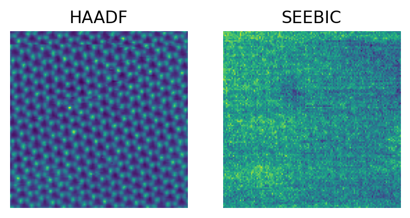
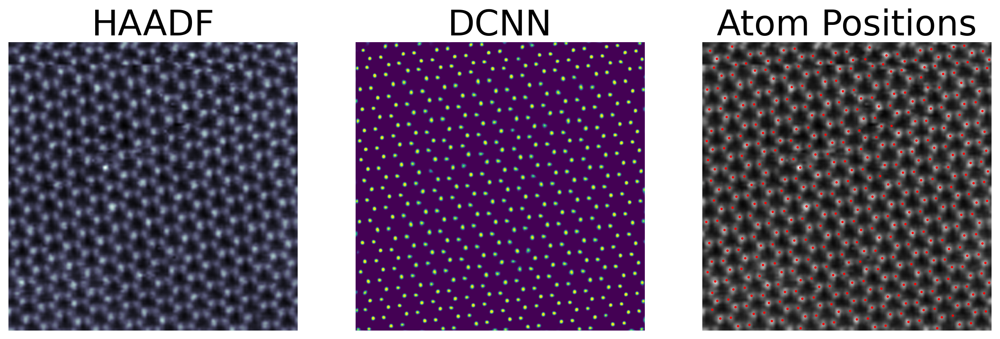
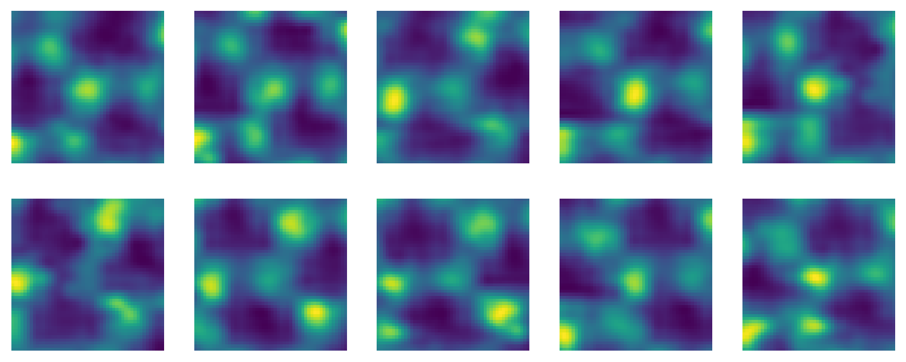
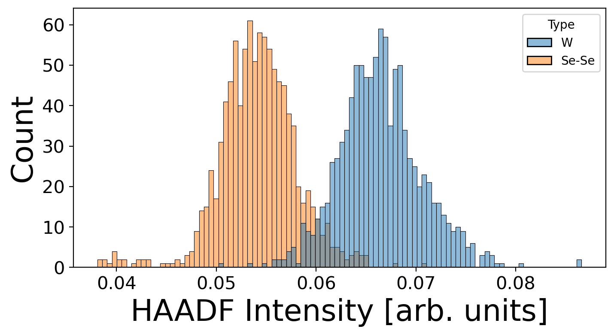
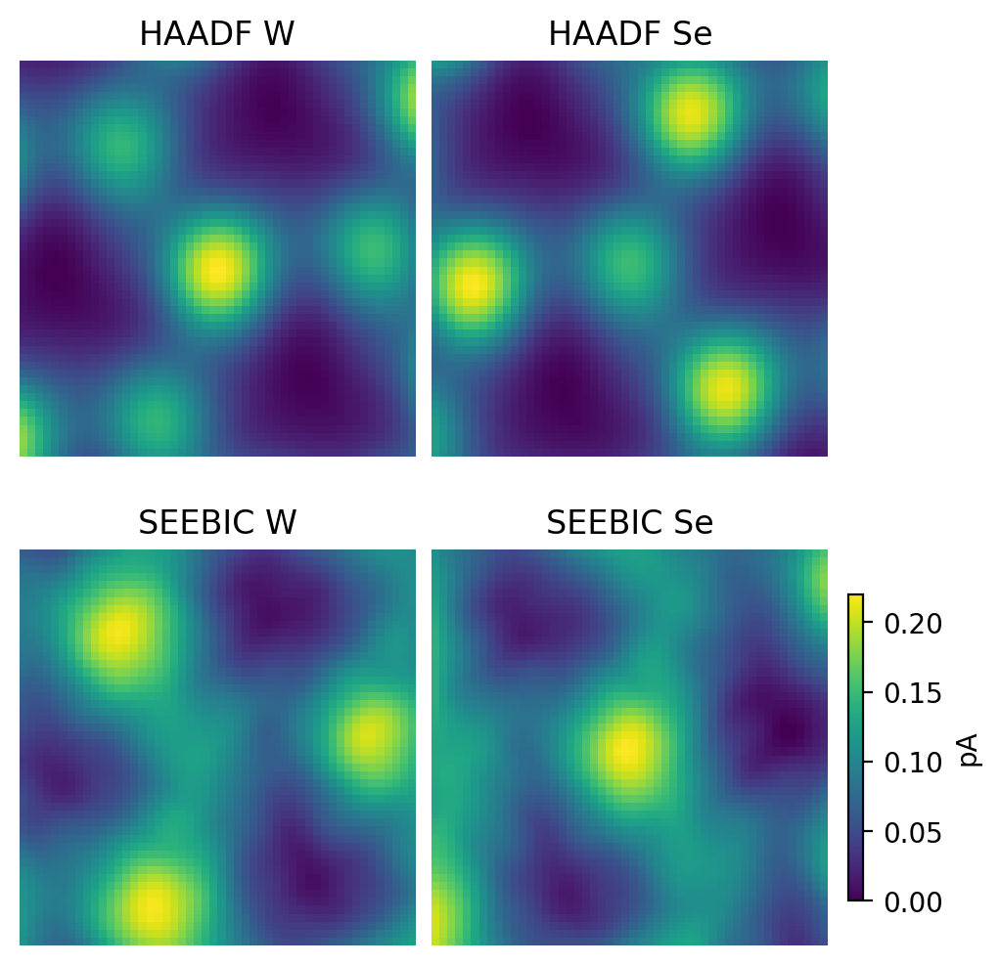

# Direct Imaging of Electron Density with a Scanning Transmission Electron Microscope

This repository houses the data and analysis workflow for the publication *Direct Imaging of Electron Density with a Scanning Transmission Electron Microscope* by Ondrej Dyck, Jawaher Almutlaq, David Lingerfelt, Jacob L. Swett, Mark P. Oxley, Bevin Huang, Andrew R. Lupini, Dirk Englund, and Stephen Jesse  published in Nature Communications in 2023.

The data is contained in the files:

SEEBIC image `Recording of SuperScan(Ext).tif`

HAADF image `Recording of SuperScan(HAADF).tif`

These images are 32 bit and do not display in most image viewers ([Imagej](https://imagej.nih.gov/ij/)/[Fiji](https://imagej.net/software/fiji/) does display them). The analysis workflow is contained in the Jupyter notebook `atomai_analysis.ipynb`. The file `G_MD.tar` contains the pretrined model weights for [AtomAI](https://github.com/pycroscopy/atomai/) atom finding. All other files are produced by the notebook.

Here are example frames from the image stacks.

_HAADF_SEEBIC_comparison.png)

The analysis workflow uses a pre-trained deep convolutional neural network (DCNN) from [AtomAI](https://github.com/pycroscopy/atomai/) to find atoms in the HAADF image.

_DCNN.png)

Image tiles are then extracted from the images centered on the lattice positions.

_example_tiles.png)

K-means clustering is used on the tiles to discriminate between the different lattice sites.

_classified_histogram.png)

Finally, the mean response for HAADF and SEEBIC signals is calculated.

_mean_response.png)

